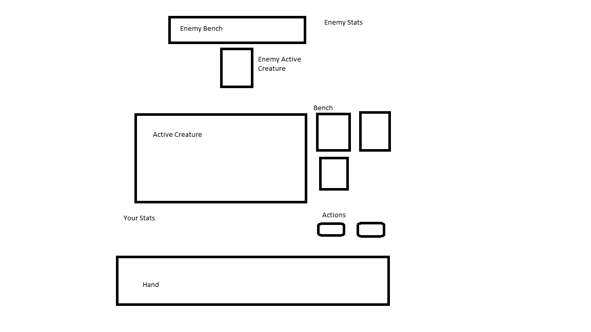

# Creating a Card Game with the Safe Stack

I have become interested in playing around with the `SAFE` Stack and have decided that it would be interesting to create an online “Card Game” using the stack. This card game should largely be similar to a simplified version of *MTG* or *Pokemon TCG*.

## Starting Project ##

Created fold for project

```
 mkdir SafeCardGame
 cd SafeCardGame
 ```

 Installed and created project from a template
```
dotnet new -i SAFE.Template
dotnet new SAFE
```

```
dotnet tool restore
dotnet fake build --target run
```

This should scaffold a basic todo app. Progress to here is located in the branch `step-1-intial-from-temp`

## Game Rules
---

My idea would be that scoping out the rules for the game might be the best first step.

### Defining the basic Domain Model and Terms
---

I think defining the domain models might be the best way to start documenting the rules.  The domain model should correlate to the object defined in the shared path of the project (i.e. src/shared). For now, I am just defining the types in the existing `Shared` module found in the Shared.fs.


The game starts with two players.

Each `Player` will start with a name and an amount of health.

```
type PlayerId = string

type Player =
    {
        PlayerId: PlayerId
        Name: string
        RemainingLifePoints: int
    }
```

Each player will have a `board` which consists of a Deck of cards, a hand, a pile of discarded, an optional active creature, a list of in play but not active creatures (i.e. a bench), a total resource pool and an available resource pool.

```
type PlayerBoard =
    {
        PlayerId: PlayerId
        Deck: Deck
        Hand: Hand
        ActiveCreature: Option<InPlayCreature>
        Bench:  Option<InPlayCreature list>
        DiscardPile: Deck
        TotalResourcePool: ResourcePool
        AvailableResourcePool: ResourcePool
    }

```

`Resource`s are typed from a finite list, i.e.:
```
type Resource =
    Grass | Fire |
    Water | Lightning |
    Psychic | Fighting |
    Colorless
```

A `ResourcePool` is simply a list of the different types of resources along with a quantity value.

```
type ResourcePool = Map<Resource, int>
```

A `Deck` and a `Hand` are both lists of `CardInstance`s, the main difference being that potentially a deck could have a number of cards exposed or visible.
```
type Hand =
    {
        Cards: CardInstance list
    }
type Deck =
    {
        Cards: CardInstance list
        TopCardsExposed: int
    }
```

Each `CardInstance` will contain a unique CardInstanceId and refers to a generic card referenced via a CardId. I am also placing the Card Type on the CardInstance, this seems pretty memory inefficient but probably doesn't matter due to the limited size of decks. For the moment it makes it much easier to manipulate the decks and pull information.
The `Card` referenced by the `CardId` will have:
* a name
* a resource cost (a `ResourcePool`)
* a Primary resource type for determining weaknesses
* a classification under one of three different types
    * `ResourceCard` - Also contains a `ResourcePool` for `AddedResource` and a bool for `ResourceAvailableOnFirstTurn`
    * `CreatureCard` - Also contains a `Creature`
    * `EffectCard`
* a `GameStateSpecialEffect` for when the card enters and leaves the game
    * the `GameStateSpecialEffect` will consist of a function which takes an arguement of the `GameState` and returns a new manipulated `GameState`

```
type CardInstanceId = string
type CardId = string
type GameStateSpecialEffect = delegate of GameState -> GameState
type CardInstance =
    {
        CardIntanceId : CardInstanceId
        CardId: CardId
        Card: Card
    }
type Card =
   CharacterCard of { CardId: CardId; Name: string; Creature: Creature; ResourceCost: ResourcePool; PrimaryResource: Resource; EnterSpecialEffects: GameStateSpecialEffect; ExitSpecialEffects: GameStateSpecialEffect}
   | EffectCard of { CardId: CardId; Name: string; ResourceCost: ResourcePool; PrimaryResource: Resource; EnterSpecialEffects: GameStateSpecialEffect; ExitSpecialEffects: GameStateSpecialEffect; }
   | ResourceCard of { CardId: CardId; Name: string; ResourceCost: ResourcePool; PrimaryResource: Resource; EnterSpecialEffects: GameStateSpecialEffect; ExitSpecialEffects: GameStateSpecialEffect; ResourceAvailableOnFirstTurn: bool; ResourcesAdded: ResourcePool}
```

A `Creature` will have integer health for total health associated with the card, a list of `Resource`s the creature is weak to, and a list of `Attacks.
An `Attack` will have an integer for the damage it inflicts, a `ResourcePool` representing the cost to use, and a `GameStateSpecialEffect` defining any additional effects which may be triggered by the attack.
```
type Creature =
    {
        Health: int
        Weaknesses: Resource list
        Attach: Attack list
    }
type Attack =
    {
        Damage: int
        Cost: ResourcePool
        SpecialEffect: GameStateSpecialEffect
    }
```
An `InPlayCreature` has an id, is associated with a `CardInstance`, a current amount of damage, an optional list of `SpecialCondition`s currently applied as well as attached and spent resource pools.
The `InPlayCreatureId` is a string and available `SpecialCondition`s are `Asleep | Burned | Confused | Paralyzed | Poisoned`

```
type SpecialCondition = Asleep | Burned | Confused | Paralyzed | Poisoned
type InPlayCreatureId = string
type InPlayCreature =
    {
        InPlayCharacterId: InPlayCharacterId
        Card: Card
        CurrentDamage: int
        SpecialEffect: Option<SpecialCondition list>
        AttachedEnergy: ResourcePool
        SpentEnergy: ResourcePool
    }
```

Lastly, the `GameState` contains a:
* Map of `PlayerId`s to `Player`s
* Map of boards for each player, a map from `PlayerId` to `PlayerBoard`
* A current turn which is an optional `PlayerId representing the player whose turn it currently is.
* A current step which is a `GameStep` representing the current step the player is on in their turn.
* Finally, it contains a turn number representing the number of turns that have passed since the beginning of the game.

The GameStep is just an enum represented by `NotCurrentlyPlaying | Draw | Play | Attack | Reconcile`

```

type GameStep =
    NotCurrentlyPlaying | Draw | Play | Attack | Reconcile

type GameState =
    {
        Players: Map<PlayerId, Player>
        Boards: Map<PlayerId, PlayerBoard>
        CurrentTurn: Option<PlayerId>
        CurrentStep:GameStep
        TurnNumber: int
    }
```


If you look at the current Shared.fs file you can see that many of the `type` declarations have been transformed into `and`s this is because F# cares about the order in which things are declared. The `type` declares a thing in a subsequent order and the `and` keyword forces the items to be declared at the same time.

Running `dotnet fake build --target run` the application **FAILED to Build** with an error message of
```
  Restored C:\tests\SafeCardGame\src\Shared\Shared.fsproj (in 197 ms).
C:\tests\SafeCardGame\src\Shared\Shared.fs(51,21): error FS0035: This construct is deprecated: Consider using a separate record type instead [C:\tests\SafeCardGame\src\Shared\Shared.fsproj]
C:\tests\SafeCardGame\src\Shared\Shared.fs(52,20): error FS0035: This construct is deprecated: Consider using a separate record type instead [C:\tests\SafeCardGame\src\Shared\Shared.fsproj]
C:\tests\SafeCardGame\src\Shared\Shared.fs(53,22): error FS0035: This construct is deprecated: Consider using a separate record type instead [C:\tests\SafeCardGame\src\Shared\Shared.fsproj]

Build FAILED.

C:\tests\SafeCardGame\src\Shared\Shared.fs(51,21): error FS0035: This construct is deprecated: Consider using a separate record type instead [C:\tests\SafeCardGame\src\Shared\Shared.fsproj]
C:\tests\SafeCardGame\src\Shared\Shared.fs(52,20): error FS0035: This construct is deprecated: Consider using a separate record type instead [C:\tests\SafeCardGame\src\Shared\Shared.fsproj]
C:\tests\SafeCardGame\src\Shared\Shared.fs(53,22): error FS0035: This construct is deprecated: Consider using a separate record type instead [C:\tests\SafeCardGame\src\Shared\Shared.fsproj]
    0 Warning(s)
    3 Error(s)
```

It appears that newer versions of F# no longer allow anonymous types in discriminated unions so I had to break out those types like:
```
type Card =
   CharacterCard of CharacterCard
   | EffectCard of EffectCard
   | ResourceCard of ResourceCard
and CharacterCard
    = { CardId: CardId; Name: string; Creature: Creature; ResourceCost: ResourcePool; PrimaryResource: Resource; EnterSpecialEffects: GameStateSpecialEffect; ExitSpecialEffects: GameStateSpecialEffect}
and EffectCard
    = { CardId: CardId; Name: string; ResourceCost: ResourcePool; PrimaryResource: Resource; EnterSpecialEffects: GameStateSpecialEffect; ExitSpecialEffects: GameStateSpecialEffect; }
and ResourceCard
    = { CardId: CardId; Name: string; ResourceCost: ResourcePool; PrimaryResource: Resource; EnterSpecialEffects: GameStateSpecialEffect; ExitSpecialEffects: GameStateSpecialEffect; ResourceAvailableOnFirstTurn: bool; ResourcesAdded: ResourcePool}

```

Now running `dotnet fake build --target run` builds.

### Defining and Drawing the Gameboard
---

My idea for the next step is to lay out the general game board.
This serves a great base to force me to actually think out the domain, show visible progress and have a base to actually plug future developments into and visualize.

I first made a sketch of what I was thinking about for the board.



I used shuffle.dev to scaffold a basic ui using Bulma ([editor avail here](https://shuffle.dev/editor?project=10d217c2a045a04ac447cd87a95c49662d831217)). Fulma, a F# strongly typed wrapper for Bulma is baked into the Safe Stack which will be utilized later on.

From my initial sketch, I scaffolded out some stuff using shuffle, downloaded the HTML, and modified the HTML to create a basic template based on my sketch.

([Bulma template for the board](documentation/html/InitialSketchOfBoard.html))

I moved things around a number of times, I was unable to make it all fit on one page (the goal) but I think I was able to improve it somewhat.

([Bulma template for the board v2](documentation/html/InitialSketchOfBoardv2.html))

I am going to move forward with this layout. In the future, I am thinking the user could toggle something to transform the cards into tables or something along those lines.

This is the final commit in the `step-3-build-the-game-board-basic-layout` branch.

### Bringing the board layout into the client
---

I feel like the next logical step is to bring the layout I just developed to the client.

First I updated the index.html file in the src/client to reference the bulmaswatch layout "darkly" like the template.

I then googled around and found an online tool to convert html to the format used by elmish to define html. This is usable and somewhat close to the Fulma format we would like to eventually support. ([HTML to Elmish Site] (https://mangelmaxime.github.io/html-to-elmish/))

Whatever we convert is going to be plugged into the <div id="elmish-app"></div> in the index.html so I needed to extract the content of the body of the layout from the body. I saved it separately: ([template to convert](documentation/html/InitialSketchOfBoardv2_toConvert.html))

This failed with no error message on the site so I am assuming it doesn't like the html somewhere.

In order to move forward, I began breaking down the html page into pieces and converting the page part by part (which is something that would eventually have to be done anyway).

This will require future refinement but I initially broke out the page into parts for the

```
    topNavigation
    enemyStats
    enemyCreatures
    playerControlCenter
    playerCreatures
    playerHand
    footerBand
```
With a general arangement of
```
<div class="container is-fluid">
    topNavigation
    <br /><br />
    enemyStats
    enemyCreatures
    <section class="section">
        <div class="container py-r">
            playerControlCenter
            playerCreatures
        </div>
    </section>
    playerHand
    footerBand
</div>

```

Going in order I dropped each of these parts into the converter. When I reached `playerControlCenter` the converter stopped working. After playing around with the html for a while (no error message was returned) I was able to discover that the converter did not like the `disabled` on the buttons.

i.e. the blocks like:
```
<button class="button is-primary" disabled>
    <span>Draw</span>
</button>
```
needed to be changed to

```
<button class="button is-primary" disabled="true">
    <span>Draw</span>
</button>
```

I don't think this is needed from an html standpoint? It is probably just a feature of the converter.


I was eventually able to convert all the html subsections defining each as a variable (will eventually be converted to a function).

i.e. like:
```
let footerBand =
  footer [ Class "footer" ]
    [ div [ Class "container" ]
        [ div [ Class "level" ]
        ...
```

I then manually created the mainLayout as

```
let mainLayout =
  div [ Class "container is-fluid" ]
    [ topNavigation
      br [ ]
      br [ ]
      enemyStats
      enemyCreatures
      section [ Class "section" ]
        [ div [ Class "container py-r" ]
            playerControlCenter
            playerCreatures ] ]
      playerHand
      footerBand
```
The results of this process ae located in ([the documentation > html > ElmishElements.fs](documentation/html/ElmishElements.fs))


I then added a `PageLayoutElements.fs` to the src/client and added the file into the `Client.fsproj` to be included and compiled coming before the `Index.fs`.

I copied and pasted the contents from the ElmishElements into this file.

This broke the build as the file needed a module to be defined and the references imported so I added

```
module PageLayoutParts

open Elmish
open Fable.React
open Fable.React.Props
open Fulma
```

to the top of the file.


This still did not build. There was an issue with a `broken-css` being added by the converter for the background-image element. As well as an issue with the way `strong` elements were converted.

The indentation was

```

                                [ strong [ ]
                                    [ str "On Enter Playing Field" ]
                                      str ": Effect description." ]
```

I needed to change it to

```

                                [ strong [ ]
                                    [ str "On Enter Playing Field" ]
                                  str ": Effect description." ]
```

i.e. the function definition is strong str not strong and two lists like many other elements.

Finally, I found that the `mainLayout` thing I wrote was invalid. I had to change it to:

```
let mainLayout =
  div [ Class "container is-fluid" ]
    [ topNavigation
      br [ ]
      br [ ]
      enemyStats
      enemyCreatures
      section [ Class "section" ]
        [ div [ Class "container py-r" ]
            [
            playerControlCenter
            playerCreatures
            ]
        ]
      playerHand
      footerBand
    ]
```

It compiled and I was then able to upload the view function in Index.fs to reference the mainLayout function.

i.e.

```
let view (model : Model) (dispatch : Msg -> unit) =
    PageLayoutParts.mainLayout
```

After viewing the page a few elements had to be rearranged and some changes had to be made. For example, changing the html unicode codes to just the unicode characters.

For the next step, we will try to make the output actually pull information from the GameState model and break down these general page parts into smaller and more usable parts.

This is the final commit in the `step-4-implement-layout-in-client` branch.